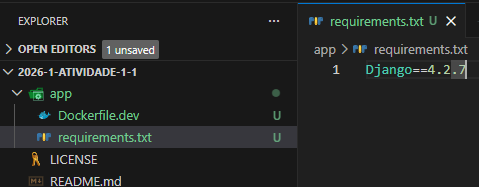
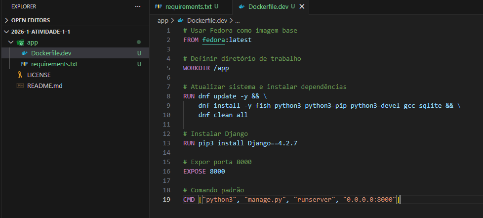
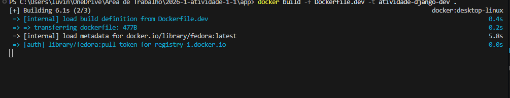

# Atividade 1.1 Avaliativa de 2026.1 - 1º Bimestre - Sistemas Operacionais
# Aluno: Lucas Vinícius Teixeira de Góis
# Matrícula: 20241014040015

## Introdução

**Neste relatório, descrevo a execução da Atividade 1.1 da disciplina de Sistemas Operacionais (IFRN/CNAT). Meu objetivo principal foi aplicar conceitos de virtualização em nível de SO utilizando o Docker. Ao longo do processo, desenvolvi um ambiente de desenvolvimento isolado para uma aplicação web com o framework Django, exercitando a criação de Dockerfiles, o mapeamento de volumes entre minha máquina e o container, e o gerenciamento de portas de rede.**

## Relato das Atividades

**Inicialmente Criei o arquivo de requirementes com o conteúdo Django==4.2.7**

**Criei o Dockerfile.dev**

**Construí a imagem de desenvolvimento**

**Executei container de desenvolvimento com volume mapeado**

.png>)

**Criei o projeto django**

.png>)

**Criar a aplicação Django**

**Verifiquei o "databases" do django**

.png>)

**Adicinei o web app no installed apps**

.png>)

**Alterei o allowed hosts**

.png>)

**Exucutei o migate**

.png>)

**Criando superuser django**

.png>)

**Alterando views.py**

.png>)

**urls.py do webapp**

.png>)

**urls.py do myproject**

.png>)

**runserver**

.png>)

**localhost**

**django admin**

.png>)

## Considerações Finais

**A atividade foi muito boa para compreender como o Docker facilita a padronização de ambientes de desenvolvimento. A maior facilidade foi a utilização do sistema de volumes, que permite manter o fluxo de trabalho no editor de texto local enquanto o código roda em um ambiente isolado.**